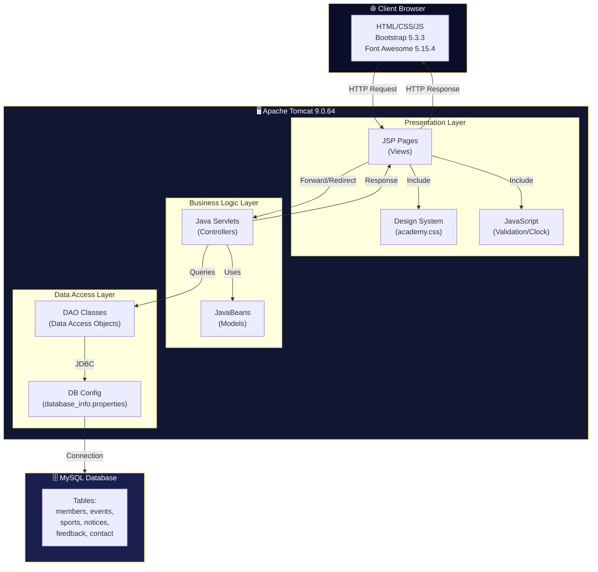
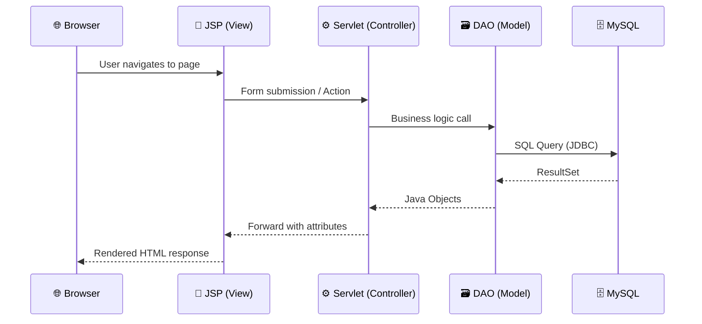
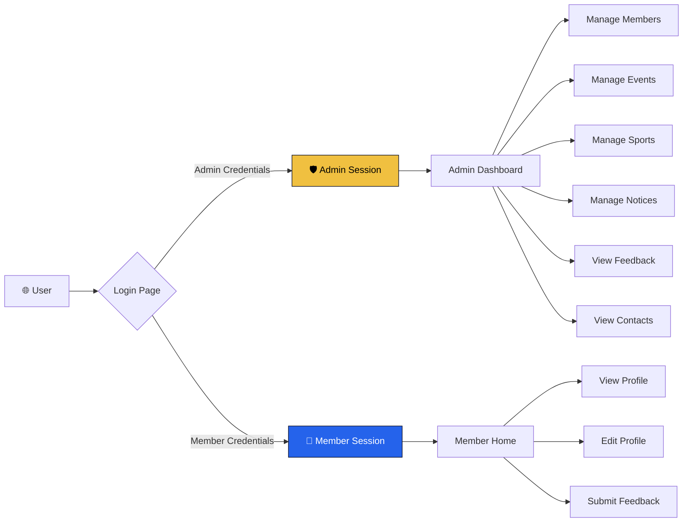
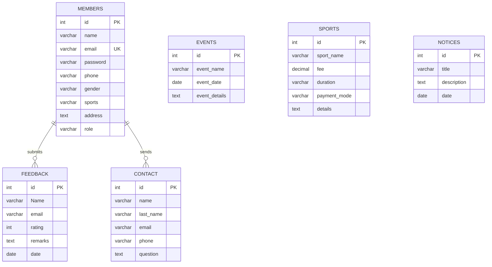

<p align="center">
  
  
  
  
  
  
</p>

<h1 align="center">🏆 Winners Sports Academy</h1>

<p align="center">
  <strong>A full-stack Java web application for managing sports academy operations — including member registration, admin dashboards, event management, feedback collection, and sport-specific training content.</strong>
</p>

<p align="center">
  <a href="#-features">Features</a> •
  <a href="#-architecture">Architecture</a> •
  <a href="#-tech-stack">Tech Stack</a> •
  <a href="#-project-structure">Structure</a> •
  <a href="#-getting-started">Setup</a> •
  <a href="#-screenshots">Screenshots</a> •
  <a href="#-license">License</a>
</p>

---

## 📋 Overview

**Winners Sports Academy** is a comprehensive sports academy management system built with **Java Servlets**, **JSP**, and **MySQL**. It features a modern, responsive UI powered by a custom CSS design system with a dark navy and gold theme, glassmorphism effects, and smooth animations.

The application supports two user roles — **Admin** and **Member** — each with dedicated dashboards, navigation, and functionality. It handles member registration, profile management, event scheduling, sport details cataloging, notice boards, feedback systems, and contact form submissions.

---

## ✨ Features

### 🔐 Authentication & Authorization
- Secure **Admin** and **Member** login portals
- Session-based authentication with role validation
- Cookie-based "Remember Me" functionality for members
- Automatic redirect for unauthorized access attempts
- Cache-control headers to prevent back-button access after logout

### 👤 Member Portal
- **Self-service Registration** with multi-sport selection and gender options
- **Profile Dashboard** displaying personalized member information
- **Edit Profile** with form pre-population from database
- **Feedback Submission** with star ratings and remarks
- Dedicated member navigation with role-specific routes

### 🛡️ Admin Panel
- **Admin Dashboard** with quick-access management cards
- **Member Management** — View all registered members in responsive tables
- **Event Management** — Add and view upcoming events
- **Sport Details** — Add sports with fee structures, duration, and payment modes
- **Notice Board** — Create and display notices to members
- **Contact & Feedback Logs** — View all submitted contacts and feedback
- **JSTL Views** — Alternative data views using JSTL + SQL tag libraries

### 🎨 Modern UI/UX
- **Custom Design System** (`academy.css`) with CSS variables and reusable components
- **Dark Navy (#0a0e27) + Gold (#f0c040)** cohesive color palette
- **Glassmorphism** effects on cards, navbar, and forms
- **Google Fonts** (Inter + Outfit) for premium typography
- **Responsive CSS Grid** layouts for all data views
- **Staggered entry animations** for visual polish
- **CSS-animated notice ticker** (replaces deprecated `<marquee>`)
- **Custom scrollbar** styling
- **Hero sections** with image overlays for sport pages

### 🏅 Sport Pages
- Individual pages for **Cricket, Football, Basketball, Badminton, Hockey, Golf, Swimming, Table Tennis, Weight Lifting**
- Embedded **YouTube training videos** in responsive grids
- Sport descriptions with animated content cards

### 🏢 Facility Pages
- **Cafeteria, Fitness Club, Equipment Shop, Coach** showcase pages
- Image galleries with hover animations

---

## 🏗 Architecture

### High-Level System Architecture



### MVC Pattern Flow



### User Role Access Flow



---

## 🛠 Tech Stack

| Layer | Technology | Version |
|-------|-----------|---------|
| **Language** | Java | 8+ |
| **Server** | Apache Tomcat | 9.0.64 |
| **Views** | JSP + JSTL | 1.2 |
| **Database** | MySQL | 8.x |
| **DB Connector** | MySQL Connector/J | 8.4.0 |
| **CSS Framework** | Bootstrap | 5.3.3 |
| **Icons** | Font Awesome | 5.15.4 |
| **Fonts** | Google Fonts | Inter, Outfit |
| **Design System** | Custom CSS | academy.css |

---

## 📁 Project Structure

```
SportsAcademy/
├── 📁 WEB-INF/
│   ├── web.xml                          # Deployment descriptor
│   ├── 📁 classes/academy/
│   │   ├── 📁 admin/                    # Admin Servlets
│   │   ├── 📁 member/                   # Member Servlets
│   │   ├── 📁 dao/                      # Data Access Objects
│   │   ├── 📁 beans/                    # JavaBean models
│   │   ├── 📁 common/                   # Shared utilities
│   │   └── 📁 dbinfo/                   # DB configuration
│   └── 📁 lib/
│       ├── jstl-1.2.jar                 # JSTL tag library
│       └── mysql-connector-j-8.4.0.jar  # MySQL JDBC driver
│
├── 📁 jsp/                              # Public-facing pages
│   ├── index.jsp                        # 🏠 Homepage (landing)
│   ├── aboutUs.jsp                      # ℹ️ About page
│   ├── Facilities.jsp                   # 🏢 Facilities overview
│   ├── Upcomingevent.jsp                # 📅 Events listing
│   ├── SportDetails.jsp                 # 🏅 Sports catalog
│   ├── football.jsp                     # ⚽ Football page
│   ├── cricket.jsp                      # 🏏 Cricket page
│   ├── basketball.jsp                   # 🏀 Basketball page
│   ├── badminton.jsp                    # 🏸 Badminton page
│   ├── hockey.jsp                       # 🏒 Hockey page
│   ├── golf.jsp                         # ⛳ Golf page
│   ├── swimming.jsp                     # 🏊 Swimming page
│   ├── weight-lifting.jsp               # 🏋️ Weight Lifting page
│   └── table tennis.jsp                 # 🏓 Table Tennis page
│
├── 📁 admin/                            # Admin panel pages
│   ├── admin-login.jsp                  # 🔑 Admin login
│   ├── admin_home.jsp                   # 📊 Admin dashboard
│   ├── Admin_header.html                # 🧭 Admin navbar
│   ├── add_event.jsp                    # ➕ Add event form
│   ├── sportdetails_add.jsp             # ➕ Add sport form
│   ├── Notice_add.jsp                   # ➕ Add notice form
│   ├── All-members.jsp                  # 👥 Members list
│   ├── view_event.jsp                   # 📋 Events table
│   ├── view_sport_details.jsp           # 📋 Sports table
│   ├── viewnotice.jsp                   # 📋 Notices list
│   ├── all-feedback.jsp                 # 💬 Feedback list
│   ├── all-contacts.jsp                 # 📞 Contacts table
│   ├── viewFeedback_JSTL.jsp            # 💬 JSTL feedback view
│   └── viewcontact_jstl.jsp             # 📞 JSTL contacts view
│
├── 📁 member/                           # Member portal pages
│   ├── member-login.jsp                 # 🔑 Member login
│   ├── member_home.jsp                  # 🏠 Member dashboard
│   ├── Member_header.html               # 🧭 Member navbar
│   ├── Registration.jsp                 # 📝 Registration form
│   ├── member_edit_profile.jsp          # ✏️ Edit profile
│   └── member-feedback.jsp              # ⭐ Feedback form
│
├── 📁 common_files/                     # Shared components
│   ├── common_css.html                  # 📦 CSS/JS imports
│   ├── common_header.html               # 🧭 Main navbar
│   └── Common_footer.html               # 📌 Footer
│
├── 📁 css/
│   └── academy.css                      # 🎨 Design system (600+ lines)
│
├── 📁 Java-script/
│   └── time.html                        # ⏰ Live clock widget
│
├── 📁 images/                           # Static images
└── 📁 videos/                           # Static videos
```

---

## 🚀 Getting Started

### Prerequisites

| Software | Version | Download |
|----------|---------|----------|
| Java JDK | 8 or higher | [Oracle JDK](https://www.oracle.com/java/technologies/downloads/) |
| Apache Tomcat | 9.x | [Tomcat Downloads](https://tomcat.apache.org/download-90.cgi) |
| MySQL Server | 8.x | [MySQL Downloads](https://dev.mysql.com/downloads/) |

### Installation

1. **Clone the repository**
   ```bash
   git clone https://github.com/your-username/SportsAcademy.git
   ```

2. **Set up MySQL Database**
   ```sql
   CREATE DATABASE sports_academy;
   USE sports_academy;

   -- Create required tables
   CREATE TABLE members (
     id INT AUTO_INCREMENT PRIMARY KEY,
     name VARCHAR(100),
     email VARCHAR(100) UNIQUE,
     password VARCHAR(255),
     phone VARCHAR(15),
     gender VARCHAR(10),
     sports VARCHAR(255),
     address TEXT,
     role VARCHAR(20) DEFAULT 'member'
   );

   CREATE TABLE events (
     id INT AUTO_INCREMENT PRIMARY KEY,
     event_name VARCHAR(200),
     event_date DATE,
     event_details TEXT
   );

   CREATE TABLE sports (
     id INT AUTO_INCREMENT PRIMARY KEY,
     sport_name VARCHAR(100),
     fee DECIMAL(10,2),
     duration VARCHAR(50),
     payment_mode VARCHAR(50),
     details TEXT
   );

   CREATE TABLE notices (
     id INT AUTO_INCREMENT PRIMARY KEY,
     title VARCHAR(200),
     description TEXT,
     date DATE
   );

   CREATE TABLE feedback (
     id INT AUTO_INCREMENT PRIMARY KEY,
     Name VARCHAR(100),
     email VARCHAR(100),
     rating INT,
     remarks TEXT,
     date DATE
   );

   CREATE TABLE contact (
     id INT AUTO_INCREMENT PRIMARY KEY,
     name VARCHAR(100),
     last_name VARCHAR(100),
     email VARCHAR(100),
     phone VARCHAR(15),
     question TEXT
   );
   ```

3. **Configure Database Connection**

   Edit `WEB-INF/classes/academy/dbinfo/database_info.properties`:
   ```properties
   url=jdbc:mysql://localhost:3306/sports_academy
   username=your_username
   password=your_password
   ```

4. **Deploy to Tomcat**
   ```bash
   # Copy the SportsAcademy folder to Tomcat's webapps directory
   cp -r SportsAcademy/ /path/to/tomcat/webapps/
   ```

5. **Start Tomcat**
   ```bash
   # Linux/macOS
   ./bin/startup.sh

   # Windows
   bin\startup.bat
   ```

6. **Access the application**
   ```
   http://localhost:8080/SportsAcademy/
   ```

---

## 🗄️ Database Schema



---

## 🎨 Design System

The project uses a fully custom design system defined in `css/academy.css` with **600+ lines** of CSS:

| Token | Value | Usage |
|-------|-------|-------|
| `--bg-primary` | `#0a0e27` | Page backgrounds |
| `--bg-secondary` | `#111633` | Card & section backgrounds |
| `--accent-gold` | `#f0c040` | Headings, borders, accents |
| `--accent-blue` | `#2563eb` | Links, interactive elements |
| `--text-primary` | `#e8e8f0` | Body text |
| `--glass-bg` | `rgba(17,22,51,0.7)` | Glassmorphism effect |
| `--font-primary` | `'Inter'` | Body typography |
| `--font-display` | `'Outfit'` | Headings typography |

### Component Library
- `.sa-card` — Glass-effect content cards
- `.sa-table-wrap` — Responsive dark-themed tables
- `.sa-auth-card` — Login/registration forms
- `.sa-section-title` — Gold-accented section headers
- `.sa-data-card` — Data display cards with animations
- `.sa-ticker` — CSS-animated notice ticker
- `.sa-navbar` — Glassmorphism sticky navigation

---

## 🔒 Security Features

- ✅ Session-based authentication for Admin & Member areas
- ✅ Role validation before page rendering
- ✅ Safe string comparisons (`"admin".equals(role)` pattern)
- ✅ Null-safe cookie handling
- ✅ Cache-control headers to prevent post-logout access
- ✅ Context-path prefixed redirects (`/SportsAcademy/...`)
- ✅ JSTL `<c:out>` for XSS-safe output rendering

---

## 🤝 Contributing

Contributions are welcome! Please follow these steps:

1. Fork the repository
2. Create a feature branch (`git checkout -b feature/amazing-feature`)
3. Commit your changes (`git commit -m 'Add amazing feature'`)
4. Push to the branch (`git push origin feature/amazing-feature`)
5. Open a Pull Request

---

## 📄 License

This project is licensed under the **MIT License** — see the [LICENSE](LICENSE) file for details.

---

## 🙏 Acknowledgments

- [Bootstrap 5](https://getbootstrap.com/) — CSS framework
- [Font Awesome](https://fontawesome.com/) — Icon library
- [Google Fonts](https://fonts.google.com/) — Inter & Outfit typefaces
- [Apache Tomcat](https://tomcat.apache.org/) — Servlet container
- [MySQL](https://www.mysql.com/) — Database engine

---

<p align="center">
  Made with ❤️ for sports enthusiasts
</p>
